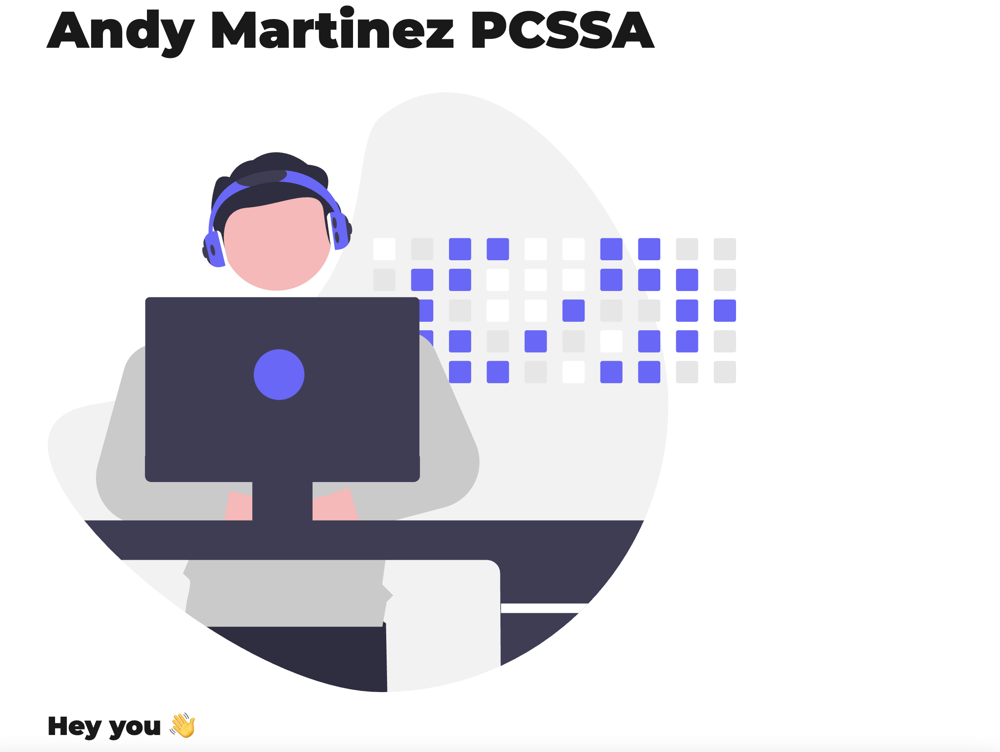

[]

This is the v01 of what will be my Personal site and blog. I will be blogging about Pega in depth concepts, tutorials, and steps by steps. I also want to work on my Front-End abilities so I'll be writing about the process of creating this Blog and other projects I start along the way. 

## 🚀 Components

1.  **Landing Page**

    Landing Page with:
    - Hero
    - About Me
    - Projects
    - Contact

2.  **Blog**

    Blog Landing Page:
    - Search all blogs
    - Blog post template

## 🎓 In the Works

1. Upgrade Class-components to functional compopnets where possible.

2. Upgrade theme and style of landing page and blog

3. Replace static queries qith useStaticQuery hook

4. Improve SEO component

5. Add read-time badge

6. Add comments to blog posts with Disqus

7. Create Projects Page and projects template

## 📝 Reasoning

Added projects in ./content/projects as a .md file in order to create a separate Projects page following the blog structure in the future. For now  
    create a projects page in src/pages
    create a project-template in src/templates
    add createProject func to gatsby-node.js to create pages

    For projects component in landing page, image will link to project page. Links to project repo until Projects page is built. Same with project title.

- **Forked from [gatsby-personal-starter-blog](https://github.com/thomaswangio/gatsby-personal-starter-blog).** 
